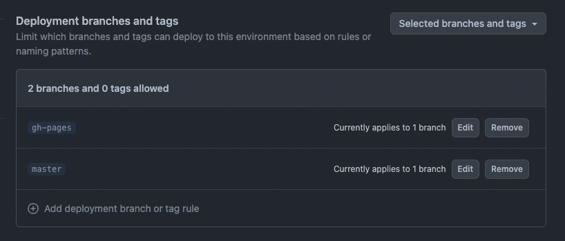

# Vanilla JS example

> [!WARNING]
> This template is archived and is more likely to be out of date.

> ⚠️ Please, avoid using vanilla JavaScript if possible on Telegram Mini Apps
> platform. It is better to use ES modules at least.

This example shows how developer could use Vanilla JavaScript to start developing at
Telegram Mini Apps platform.

This template demonstrates how developers can implement an application on the Telegram
Mini Apps platform using the following technologies and libraries

- [TON Connect](https://docs.ton.org/develop/dapps/ton-connect/overview)
- [Telegram SDK](https://core.telegram.org/bots/webapps#initializing-mini-apps)

> This boilerplate was created using [pnpm](https://pnpm.io/). Therefore, it is required to use
> it for this project as well.

## Install Dependencies

If you have just cloned this template, you should install the project dependencies using the
command:

```Bash
pnpm install
```

## Scripts

This project contains the following scripts:

- `serve`. Runs the HTTP server to serve `./dist/index.html`.
- `tunnel`. Runs tunnel to locally launched HTTP server.

`tunnel` command will return a URL which has to be used by [@BotFather](https://t.me/botfather). Bind
it to your Mini App and open the application.

To run a script, use the `pnpm run` command:

```Bash
pnpm run {script}
# Example: pnpm run serve
```

## Create Bot and Mini App

Before you start, make sure you have already created a Telegram Bot. Here is
a [comprehensive guide](https://docs.telegram-mini-apps.com/platform/creating-new-app) on how to
do it.

## Run

Although Mini Apps are designed to be opened
within [Telegram applications](https://docs.telegram-mini-apps.com/platform/about#supported-applications),
you can still develop and test them outside of Telegram during the development process.

To serve `./dist/index.html`, use the `serve` script:

```bash
pnpm run serve
```

After this, you will see a similar message in your terminal:

```bash
Serving!
  - Local: http://localhost:3000
  - Network: http://192.168.0.117:3000
```

Here, you can see the `Local` link, available locally, and `Network` links accessible to all
devices in the same network with the current device.

To view the application, you need to open the `Local`
link (`http://localhost:3000` in this example) in your browser.

It is important to note that some libraries in this template, such as Telegram SDK, are not
intended for use outside of Telegram.

### Run Inside Telegram

Although it is possible to run the application outside of Telegram, it is recommended to develop it
within Telegram for the most accurate representation of its real-world functionality.

To run the application inside Telegram, [@BotFather](https://t.me/botfather) requires an HTTPS link.

This template already provides a solution.

Run next script:

```bash
pnpm run tunnel
```

After this, you will see a similar message in your terminal:

```bash
your url is: https://odd-yaks-smash.loca.lt
```

Once the application is displayed correctly, submit one of the `Network` links as the Mini App link
to [@BotFather](https://t.me/botfather). Then, navigate
to [https://web.telegram.org/k/](https://web.telegram.org/k/), find your bot, and launch the
Telegram Mini App. This approach provides the full development experience.

## Deploy

This boilerplate uses GitHub Pages as the way to host the application externally. GitHub Pages
provides a CDN which will let your users receive the application rapidly. Alternatively, you could
use such services as [Heroku](https://www.heroku.com/) or [Vercel](https://vercel.com).

### Manual Deployment

This boilerplate uses the [gh-pages](https://www.npmjs.com/package/gh-pages) tool, which allows
deploying your application right from your PC.

#### Configuring

Before running the deployment process, ensure that you have done the following:

1. Replaced the `homepage` value in `package.json`. The GitHub Pages deploy tool uses this value to
   determine the related GitHub project.

For instance, if your GitHub username is `telegram-mini-apps` and the repository name
is `is-awesome`, the value in the `homepage` field should be the following:

```json
{
  "homepage": "https://telegram-mini-apps.github.io/is-awesome"
}
```

You can find more information on configuring the deployment in the `gh-pages`
[docs](https://github.com/tschaub/gh-pages?tab=readme-ov-file#github-pages-project-sites).

#### Before Deploying

Then, run the deployment process, using the `deploy` script:

```Bash
pnpm run deploy
```

After the deployment completed successfully, visit the page with data according to your
username and repository name. Here is the page link example using the data mentioned above:
https://telegram-mini-apps.github.io/is-awesome

### GitHub Workflow

To simplify the deployment process, this template includes a
pre-configured [GitHub workflow](.github/workflows/github-pages-deploy.yml) that automatically
deploys the project when changes are pushed to the `master` branch.

To enable this workflow, create a new environment (or edit the existing one) in the GitHub
repository settings and name it `github-pages`. Then, add the `master` branch to the list of
deployment branches.

You can find the environment settings using this
URL: `https://github.com/{username}/{repository}/settings/environments`.



In case, you don't want to do it automatically, or you don't use GitHub as the project codebase,
remove the `.github` directory.

### GitHub Web Interface

Alternatively, developers can configure automatic deployment using the GitHub web interface. To do
this, follow the link: `https://github.com/{username}/{repository}/settings/pages`.

## TON Connect

This boilerplate utilizes the [TON Connect](https://docs.ton.org/develop/dapps/ton-connect/overview)
project to demonstrate how developers can integrate functionality related to TON cryptocurrency.

The TON Connect manifest used in this boilerplate is stored in the `dist` folder, where all
publicly accessible static files are located. Remember
to [configure](https://docs.ton.org/develop/dapps/ton-connect/manifest) this file according to your
project's information.

## Useful Links

- [Platform documentation](https://docs.telegram-mini-apps.com/)
- [Telegram developers community chat](https://t.me/devs)
